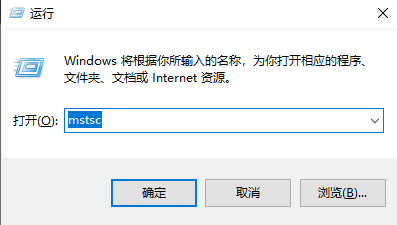
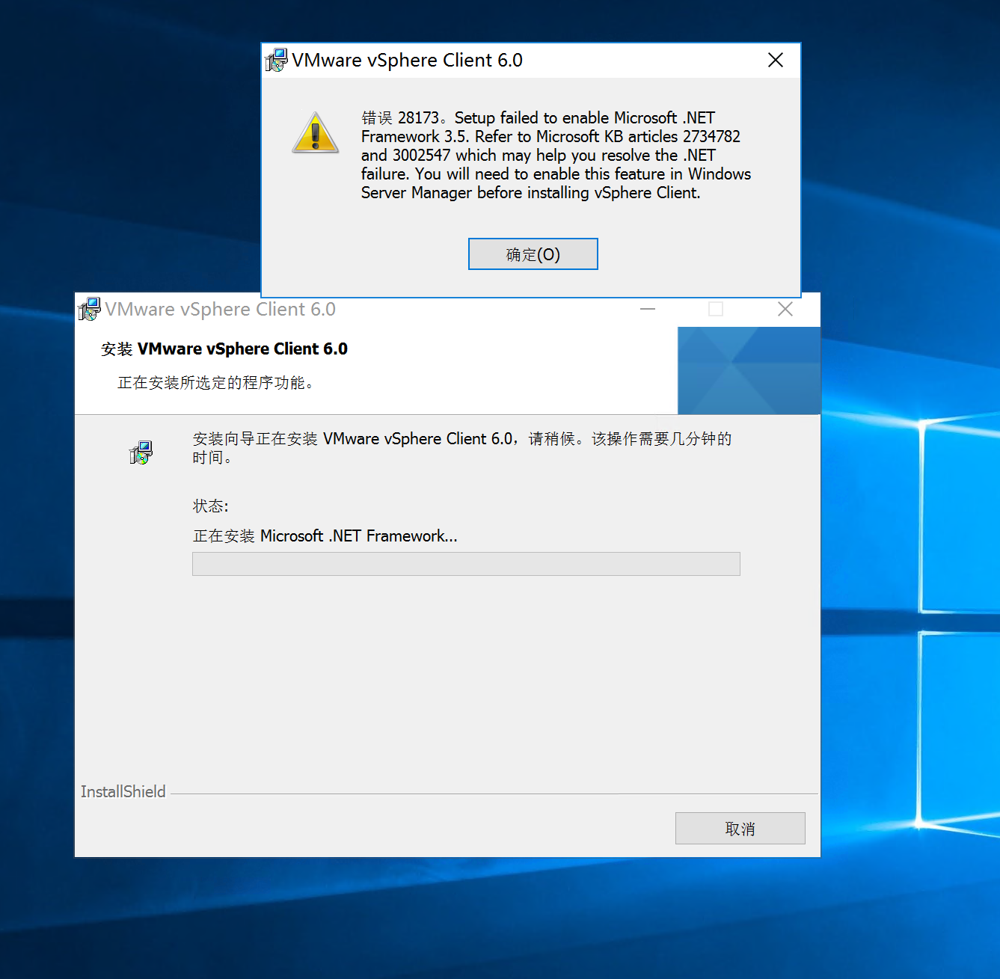
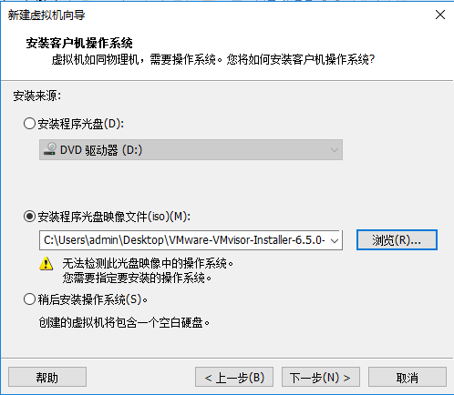
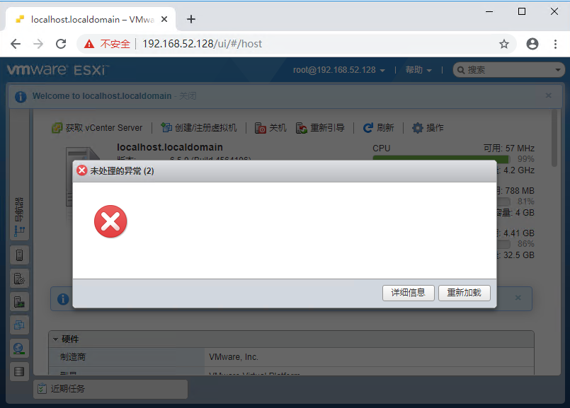

# ESXi实验常见问题

## 如何登录实验虚拟机
  
在云平台中查看虚拟机访问IP、账户以及密码

- Windows
  - win+R 打开“运行”，然后输入`mstsc`，然后在弹出窗口中输入IP、账号、密码即可

- MacOS
  - 使用Parallels等工具连接

## 云平台上没有显示虚拟机IP或显示的IP无法登录怎么办

可以用来登录的IP均为10.251.254.\*或10.251.255.\*，如果云平台上显示的IP是169.\*.\*.\*或者无IP则暂时无法登录，需要重启电脑重新获取IP。需要注意的是，虚拟机的重启、以及DHCP IP的获取都需要时间，开机后应等待3分钟以上，请勿频繁开关机

## 用到的安装包、镜像文件如何获取

- Workstation安装包(`Mware-workstation-full-14.1.3-9474260.exe`)、ESXi镜像(`VMware-VMvisor-Installer-6.5.0-4564106.x86_64-Dell_Customized-A00.iso`)、TinyOS镜像(`Core-10.1.iso`)以及可选使用的CentOS镜像(`CentOS-7-x86_64-Minimal-1908.iso`)均放在了实验虚拟机桌面上，可以直接使用。
- vSphere Client安装包可以在[课程中心下载](http://course.buaa.edu.cn/access/content/group/b7656edd-6e82-4c48-80b3-c9397cf89f72/%E4%BA%91%E5%AE%9E%E9%AA%8C%E8%B5%84%E6%BA%90/VMware-viclient-all-6.0.0.exe)（推荐此方式）或在[临时的资源存放网站](http://10.251.254.150/VMware-viclient-all-6.0.0.exe)下载。

- 同时，所需的资源文件都在[临时的资源存放网站](http://10.251.254.150)存有备份

## Workstation与ESXi在本实验中的用处

Workstation是用来安装ESXi的。安装ESXi成功后，只要保证Workstation正常运转即可，后续的实验**都是通过vSphere (Web) Client在ESXi中完成的**

## 安装workstation时报错的解决方法（关于 .net framework的错误）

打开浏览器登录校园网验证，连接网络之后会自动安装补丁修复此错误。

## 如何在workstation中载入ESXi镜像

- 在workstation中，创建虚拟机时

## 载入workstation后界面无反应/鼠标消失怎么办

workstation中的虚拟机是会占用鼠标的，按ctrl+alt即可将鼠标焦点从workstation虚拟机中移出。如果安装程序超过2分钟还没有自动启动，重启workstation中的ESXi虚拟机

## 安装ESXi时的IP如何配置

ESXi的IP不需要特殊配置，使用DHCP分配的动态IP即可。请注意，此IP只在虚拟机中可以有有效访问

## 如何登录vSphere Client

安装[vSpehre Client](http://course.buaa.edu.cn/access/content/group/b7656edd-6e82-4c48-80b3-c9397cf89f72/%E4%BA%91%E5%AE%9E%E9%AA%8C%E8%B5%84%E6%BA%90/VMware-viclient-all-6.0.0.exe)成功后，打开vSphere Client，输入ESXi显示的IP，以及安装ESXi过程中设置的账号密码即可登录。

## 使用web client还是传统的本地client

本次实验大部分操作要求在本地client中完成。如果遇到本地client无法完成的操作，则要登录web client完成

## 访问web client时报错的解决方法

按ESC键忽略此错误即可
