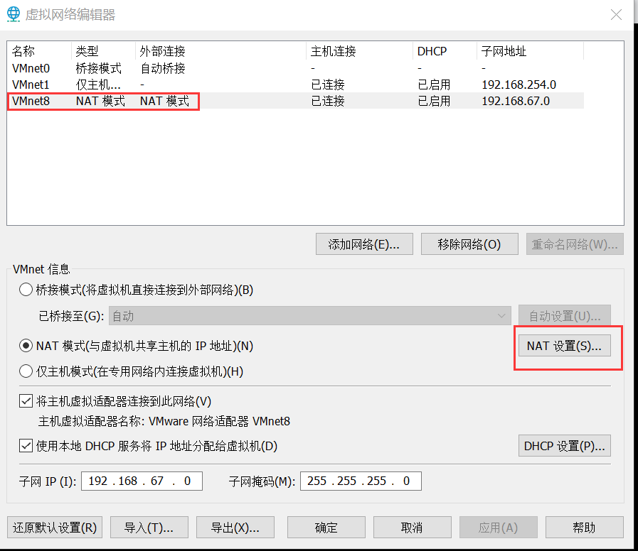
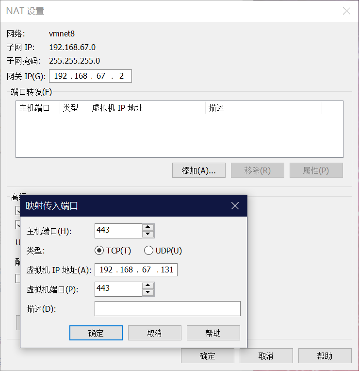
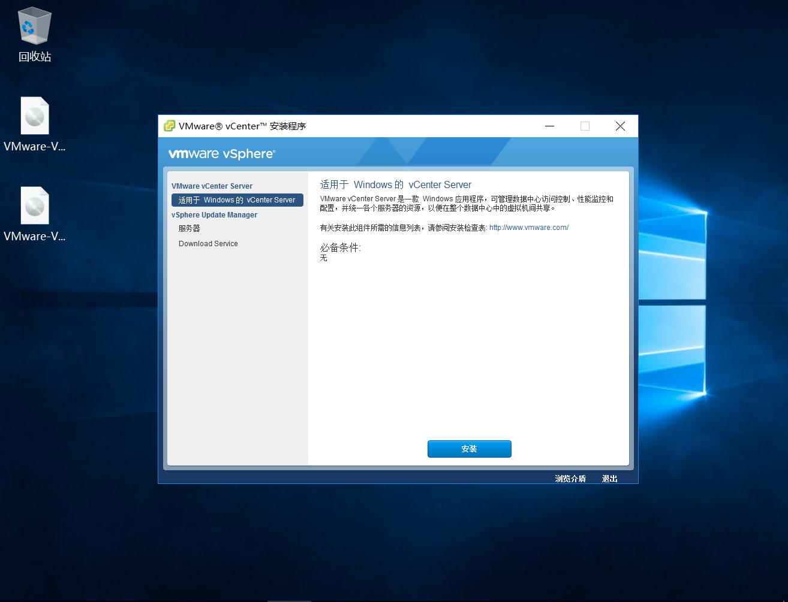
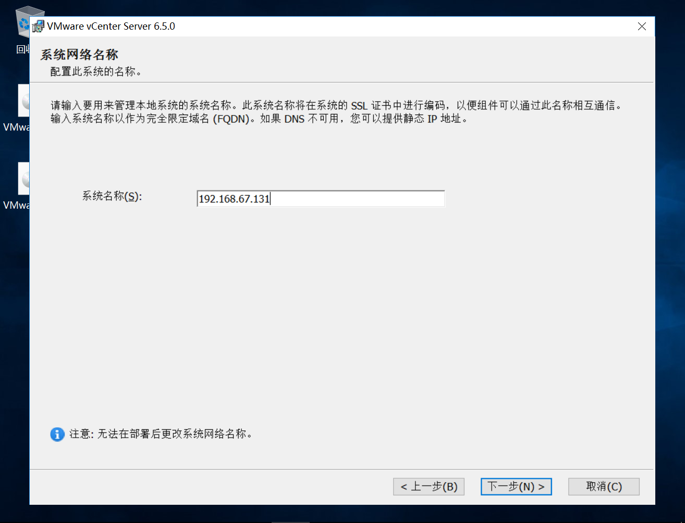
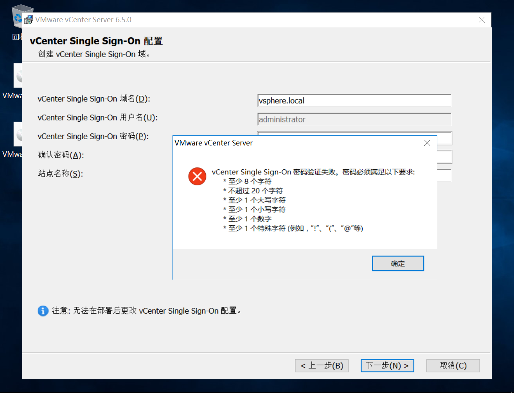
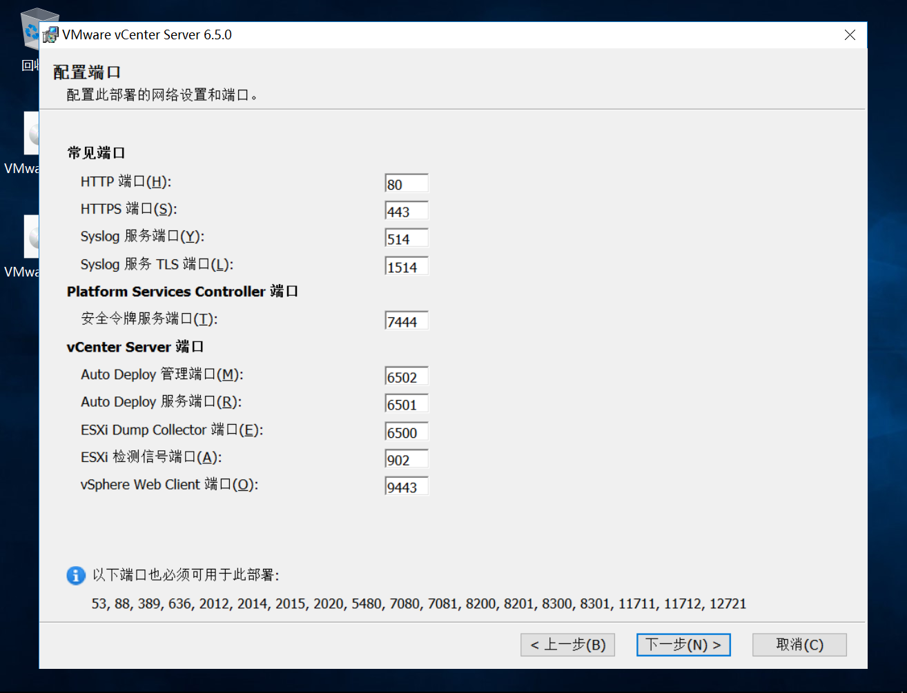
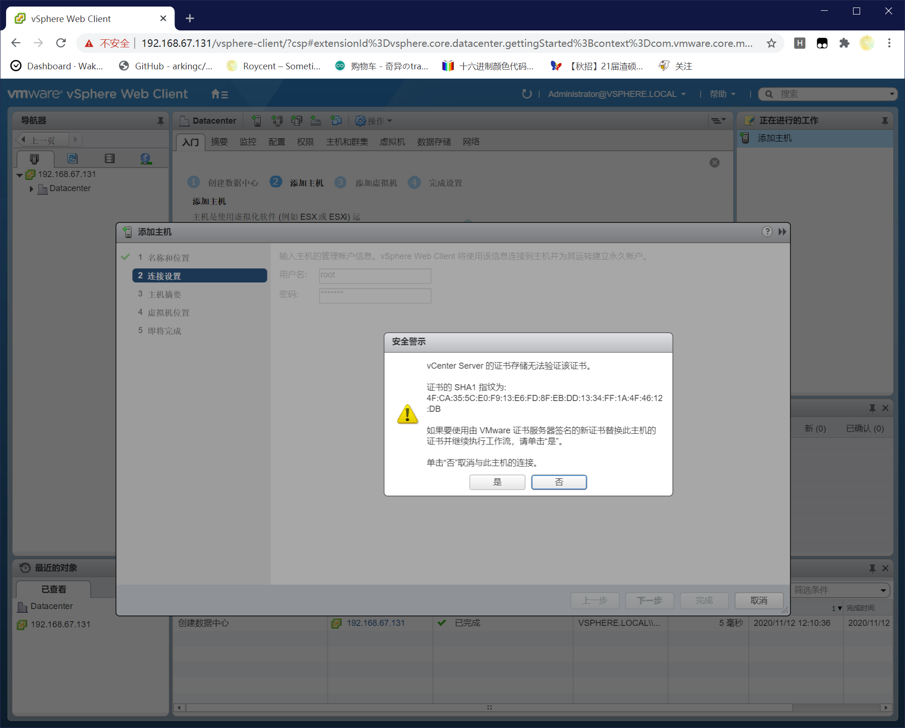

# 虚拟化实验（下）

## ESXi 与 vCenter

在上一个实验中，我们进行了ESXi的部署，并使用ESXi创建了一些虚拟机。在实际应用中，往往需要多个ESXi主机组成集群，来提供更多的资源，或者提高可用性。在本实验中，我们将使用vCenter Server管理多个ESXi主机，来管理所有的虚拟机和ESXi“物理机”集群。由于在实验过程中需要多个ESXi节点，因此推荐**两人一组**来完成实验，如果你有信心独立完成实验也可以，但是由于虚拟机配置有限，实验过程可能会不太流畅。

## 安装前的准备

1、 安装并配置ESXi

2、 准备[vCenter Server安装包](https://bhpan.buaa.edu.cn:443/link/4587ADF51E725BC6E4D919BF6AA31298)

## 安装步骤

两人一组的两台实验虚拟机（分别记为不安装vCenter Server的虚拟机A、安装vCenter Server的虚拟机B）安装步骤不同，请一定注意，避免不必要的操作浪费时间和精力。

### 虚拟机A

由于vCenter Sever安装在虚拟机B上，因此虚拟机A无需再安装软件，只需要使虚拟机B可以访问到虚拟机A上的服务即可。访问虚拟机A上ESXi需要两个端口：443、902. 

1、 打开Workstation，选择编辑-虚拟网络编辑器。点击右下角[更改设置]。然后选择[VMnet8]（NAT模式）,点击[NAT设置...]
    

2、 在弹出的窗口中，选择[添加]，主机端口填写443、类型选择TCP，虚拟机IP地址选择ESXi的地址（也就是192.168开头的，在虚拟机内部访问ESXi时使用的地址），虚拟机端口填写443。重复上述过程，再添加902端口。

    
3、 添加后，应该可以通过`https://虚拟机IP`访问ESXi服务。此处的虚拟机IP指10.251开头的实验虚拟机地址。

### 虚拟机B

1、 打开Workstation，选择编辑-首选项-共享虚拟机，点击[更改设置]按钮后，选择[禁用共享]。此步骤是为了取消Workstation对虚拟机443端口的占用。

2、 打开任务管理器-详细信息，找到`vmware-authd`进程，并点击右键结束这个进程。此步骤是为了取消902端口的占用。这步关闭的都是共享虚拟机相关的服务，与本次实验无关。

3、 打开vCenter Server安装包`VMware-VIM-all-6.5.0-4602587.iso`，双击`autorun`启动安装程序。**之后的安装步骤，如无特殊说明，无需改动默认选项，直接下一步即可**
    

4、 点击[安装]按钮，（等待几十秒），会弹出另一个安装页面。选择默认选项“vCenter Server 和嵌入式Platform Services Controller”。

5、 在`系统网络名称`页面，要填入虚拟机的本机IP。点击确认后会弹出两次提示，确认并无视即可。**本实验中应该是10.251开头的IP**
    

6、 在`vCenter Single Sing-On 配置`页面，需要设置登录vCenter的密码。域名建议不改动，密码需要符合下面的要求，站点名称可以随意更改。
    

7、 vCenter Server所需的端口。第1~2步执行完毕后，此步骤应该可以直接完成。如果点击下一步时提示某个端口被占用，在cmd中执行`netstat -ano | findstr "{port_num}"`即可找到占用端口的进程（把`{port_num}`替换为相应的端口号，注意两侧有引号），然后打开任务管理器-详细信息找到对应进程号的进程并结束即可。**不推荐**更改默认端口号。
    

8、 安装完成后，浏览器访问虚拟机地址或者使用vSphere Client均可访问到vCenter。账号为`adminstrator@vsphere.local`，密码为第6步中设置的密码。

9、 登录到vCenter，创建数据中心、并选择添加主机。在添加主机时会弹出安全警示，选择“是”继续添加即可。
    

10、 将虚拟机A、虚拟机B上的ESXi均添加到vCenter中。添加完成后，可以查看并管理两个ESXi上的虚拟机。（添加虚拟机A上的ESXi时，使用的是10.251开头的地址，添加虚拟机B上的ESXi主机时，使用的是192.168开头的地址）

### 单人进行实验

安装vCenter Server的步骤不变，无需设置端口转发。除之前实验创建的ESXi虚拟机之外，还需要再创建一个ESXi虚拟机。然后将这两个ESXi主机都加入到集群中。

## 其他提示/建议

1、建议通过Web Client（浏览器直接访问）使用Flash访问，或者使用vSphere Client（如果连接时没有报错的话）。

2、两个ESXi主机在加入vCenter时，使用的是不同的地址（一个相当于端口转发的“外网地址”，一个是本地的内网地址），区分好每个地址的意义以及可用范围。

3、由于带图形化界面的CentOS会占用较多资源，在实验时关闭或者删除这些虚拟机，使用TinyOS（即桌面上的Core镜像文件）会获得更好的实验体验。

4、如果在安装vCenter Server时提示存储空间不足，可以直接扩展C盘空间（有很多未分配的存储空间）。

## 可能遇到的问题

### 虚拟机A在添加NAT端口转发后，外网（实体机）仍然无法通过虚拟机地址访问ESXi服务

windows+R -> services.msc 打开服务窗口，查看`VMware NAT Service`是否正在运行。如果不在运行，尝试启动该服务。如果启动过程中报错，重启虚拟机。**重启后，ESXi虚拟机并不会自动启动，需要手动恢复**

### 虚拟机B在安装vCenter Server时，提示某端口被占用

参见虚拟机B配置步骤1~2，以及步骤7.